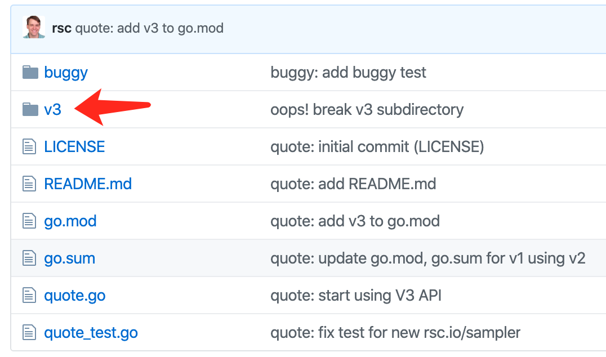

<!-- toc -->
# Go 语言项目的代码管理

为什么把这一节放在最前面？因为这就是最首要的事情。

Go 项目的源代码管理是一个老大难的问题，Russ Cox 在[《A Proposal for Package Versioning in Go》][2]中详细介绍了整个过程：最开始毫无办法，然后鼓励社区自己解决，于是 godep、glide 等遍地开花，人人苦恼，最后 Russ Cox 灵机一动，设计了 go module。

从 1.13 开始，GOPATH 不再是必须的，Go 的项目代码可以位于任意位置，只要使用了 go module。Go blog 用了整整 4 篇博客介绍它的用法：

* [Using Go Modules][3]
* [Migrating to Go Modules][4]
* [Publishing Go Modules][5]
* [Go Modules: v2 and Beyond][6]

把这四篇博客看完，就可以告别本页了。

## 要解决的问题

最早的时候 go get 直接从 github 拉取 master 上的最新代码，问题特别大，以至于很多人的解决方法是把整个 GOPATH 目录作为项目目录，依赖代码的更新成为噩梦，不知道依赖的是哪个版本，至于依赖的依赖那就更 !@#$%^&*()......

后来 godep、glide、dep，以及 vendor 等分别解决了依赖代码管理的问题，但是仅此而已。在大型项目中，常常会使用一套代码的不同版本，这时候前面的各种工具就「摊手」了。

另外，项目必须位于 GOPATH 中、代码 repo 获取缓慢并占用本地空间等问题也让人烦恼。

## 问题解决方法

Russ Cox 通过引入版本管理方法 [Semantic Versioning][7] 限定了问题空间，然后重新设计了依赖代码的索引和获取方法，以及本地缓存机制。

依赖代码以及我们自己的 Go 语言项目需要采用 Semantic 版本命名法，也就是 `vMAJOR.MINOR.PATCH-suffix` ，约定如下：

* 只有不向后兼容的时候，譬如修改了 API 时，才可以变更主版本
* 同一个主版本下的多个子版本，对用户而言可以无脑升级，无需重新适配
* v0.x.x 版本是最自由的版本，v1.x.x 开始要对用户负责

使用 Semantic Versioning 对 go module 来说很重要， 因为多版本依赖建立在该基础上：

* 同一套代码的多个主版本通过 `/vX` 后缀区分（从 v2 开始需要后缀）
* 不支持同时引用同一主版本的多个小版本

例如，同时依赖 rsc.io/quote 的 v1 和 v3 版本，用下面的方法：

```go
import (
    "rsc.io/quote"
    quoteV3 "rsc.io/quote/v3"
)
```

这种做法有一个问题：为了向后兼容，即兼容没有使用 go module 的项目，新的主版本需要独占一个目录。

例如上面的 [rsc.io/quote][8]：



v3 不仅是真实存在的目录，而且是一个独立的 go module，它有自己的 v3/go.mod，内容如下：

```go
module rsc.io/quote/v3

require rsc.io/sampler v1.3.0
```

这意味着开发 v3 的时候，需要把代码拷贝一份，代码仓库中会有很多冗余代码。
如果引用端使用了 go module，是否可以避免使用独立的主版本目录呢？下面通过试验验证，同时演示 go module 的常规用法。


## 参考

1. [李佶澳的博客][1]

[1]: https://www.lijiaocn.com "李佶澳的博客"
[2]: https://blog.golang.org/versioning-proposal "A Proposal for Package Versioning in Go"
[3]: https://blog.golang.org/using-go-modules "Using Go Modules"
[4]: https://blog.golang.org/migrating-to-go-modules "Migrating to Go Modules"
[5]: https://blog.golang.org/publishing-go-modules "Publishing Go Modules"
[6]: https://blog.golang.org/v2-go-modules "Go Modules: v2 and Beyond"
[7]: https://semver.org/ "Semantic Versioning 2.0.0"
[8]: https://github.com/rsc/quote "rsc.io/quote"
